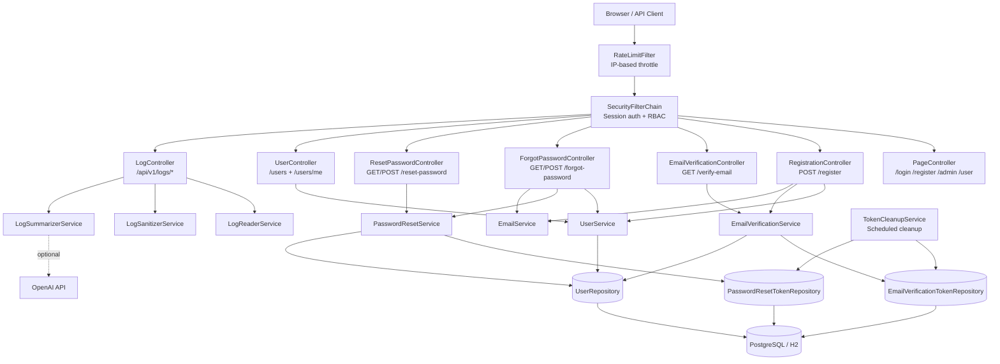

# user-management-api

A streamlined Spring Boot application for managing user accounts with authentication, registration, profile updates, and basic REST endpoints.

## About

- Authentication & authorization with role-based access (ADMIN / USER)
- Registration with email verification
- Password reset via secure tokens
- User profile management (`/users/me`)
- Optional AI-powered log summarization

## Features Overview

## Architecture Diagram

[](https://mermaid.live/edit#pako:eNqVlW1v2jAQx79K5Fd7APIAARpNlVrabpU6lUG3Fwu8cMkRrCZ2ZDvtaNXvPjtOApRAN14459z_fne-Q84LWrAIUICWCXtarDCX1t3FjFrqN0oIUBmec_YkgFu2dTa-Ll_OrXb71JpgCTckJTKsrSuSSOBf7rl9ej1u32MBkSVXnEmZwNxga23BmMIi50Suw8owhNEKE1pgpiAEYdTCuVxZn63J-dlIgQyqiilIYxyDCPU6YlRyliRlIXbCYkItm0NMhNQnwVGqX-TqWPMG0qQUhsbgWKoC3kDHt9O7DbKJ8gs4Wa7DyxSTpLDJogn09VJxHgttG7S2iXXFeMxkaB5jLMQT49E-yDZVLQtZOyt1zUcUoMam13dxXKuO0n6qRopQr29br1ss1NiMYafQFH7DYhGq5W0wzoj96OrxCftTPfRqOnXmKfBHsoAG717v35HWbiMwE_wHkplLc0FbvqrTRdsPiXYLMXUq-RGAURUzaC5B97dq9ARwdMQ9xZRI8nxMkacp5juSWrTns9odlul24aSjwm8zoGfXoXno62S-XX0dU55hAhkLP1SWIJLx9cfy_3NoHpsW3rEHoAaxJ659_wGt6jDSpknsjGgr_Y72QOqDvE3aTaP0vnBenCs6EzLmMP1xo27ob97OWepkpXo3177X-Iv3owQwzbNwe1PWZa7lxQqiPFHX-8I45w2t3-c192hGUQvFnEQokDyHFkqBK5DaohfNmCG5ghRmKFBmhPnDDM3oq4rJMP3NWFqFcZbHKxQscSLULs8i9am5IDjmeCMBGulrKqcSBX5BQMEL-oOCttMZ9vuDYc91vIHr-8Oecq9R4Lr9zsDz-17X9Z2-c9LrvbbQc5HV6ZwMva7vdvvewPG9rjNsIYj0YL-bj2rxbX39C-LagoE)



### Rate Limiting
- IP-based rate limiting on critical public endpoints
- Token bucket algorithm (Bucket4j)
- Example: `/login` limited to 10 requests per minute

### Secure Password Handling
- Passwords hashed with **BCrypt**
- Token-based password reset flow
- Email-based reset link generation

### Session-Based Authentication
- Form login with HTTP sessions (Spring Security)
- Role-based redirects to `/admin` and `/user` dashboards
- Email verification required before login

### Structured Logging
- JSON-style logs with sensitive data masked
- Optional AI log summaries via `/api/v1/logs/summarize`

## REST API – Key Endpoints
[try out the REST API on swagger](https://user-management-api-java.up.railway.app/swagger-ui/index.html)

**Public**

- `POST /register` – Create a new account
- `GET /verify-email?token=...` – Verify account
- `POST /forgot-password` – Request password reset
- `POST /reset-password?token=...` – Set new password

**Authenticated Users**

- `GET /users/me` – View own profile
- `PUT /users/me` – Update own email / password

**Admin Only**

- `GET /users` – List all users
- `POST /users` – Create user
- `PUT /users/{id}` – Update any user
- `DELETE /users/{id}` – Delete user

## Requirements

- Java 17+
- Spring Boot 3.4.5
- Maven 3.6+
- PostgreSQL (prod) or H2 (local dev)

## Quick Setup

**Local (H2, no external DB):**
```bash
mvn spring-boot:run -Dspring-boot.run.profiles=local
```

Docker (PostgreSQL):

```
docker run -d -p 8080:8080 
  -e PGHOST=your-db-host 
  -e PGPORT=5432 
  -e PGDATABASE=userdb 
  -e PGUSER=dbuser
  -e PGPASSWORD=dbpass 
  user-management-api 
```
License

For educational and demonstration purposes.
