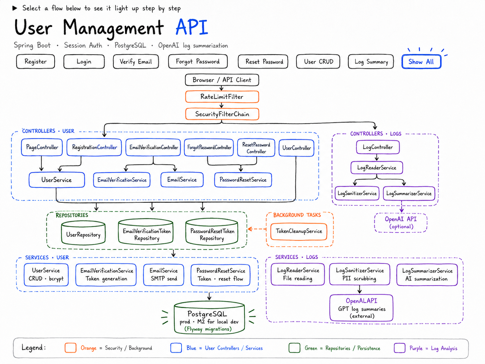
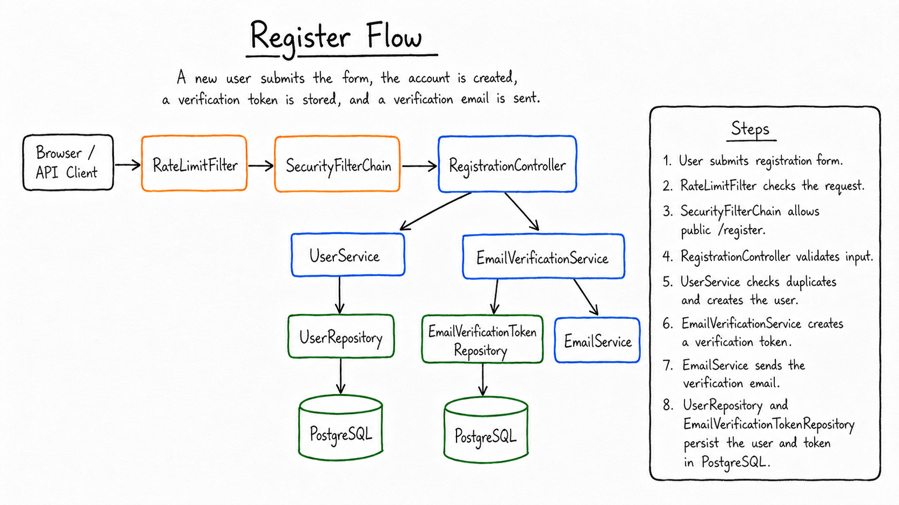
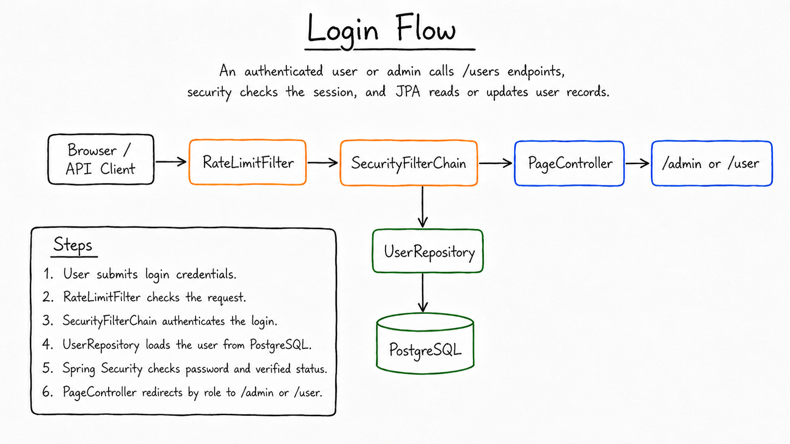
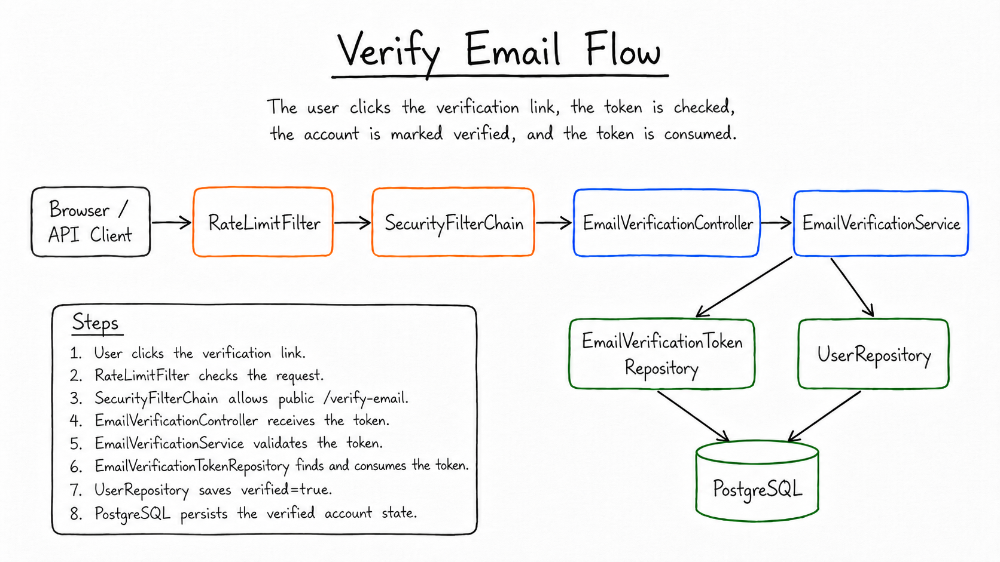
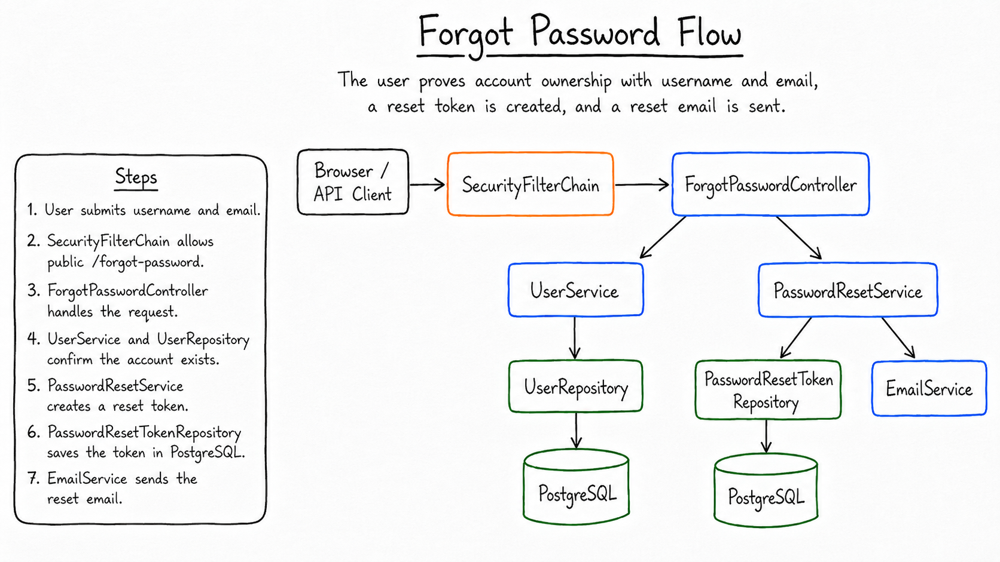
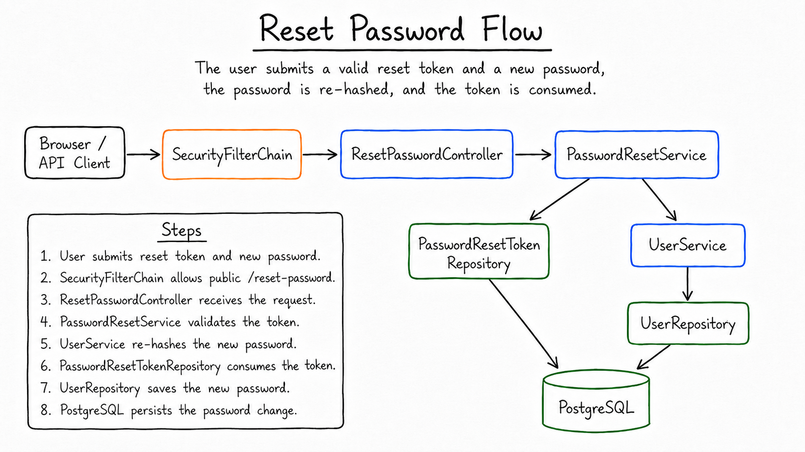
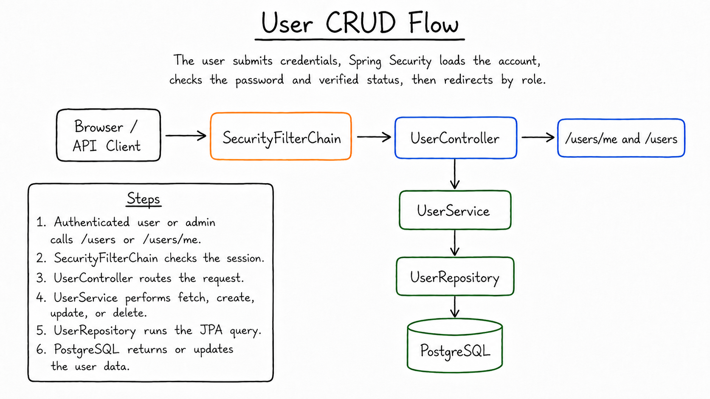
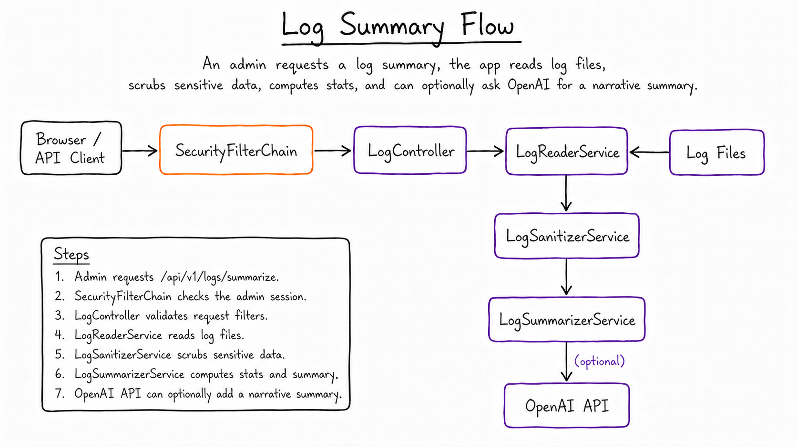

# user-management-api

A streamlined Spring Boot application for managing user accounts with authentication, registration, profile updates, and basic REST endpoints.

## About

- Authentication & authorization with role-based access (ADMIN / USER)
- Registration with email verification
- Password reset via secure tokens
- User profile management (`/users/me`)
- Optional AI-powered log summarization

## Features Overview

## Architecture Diagram

<p align="center">
  
</p>

## Flow walkthroughs

These hand-drawn flow diagrams show the main request paths through the application. Box colors match the architecture layers: orange for security/filtering, blue for user-facing controllers and services, green for repositories and persistence, and purple for log analysis.

<p align="center">
  
</p>

<p align="center">
  
</p>

<p align="center">
  
</p>


<p align="center">
  
</p>

<p align="center">
  
</p>

<p align="center">
  
</p>

<p align="center">
  
</p>

### Rate Limiting
- IP-based rate limiting on critical public endpoints
- Token bucket algorithm (Bucket4j)
- Example: `/login` limited to 10 requests per minute

### Secure Password Handling
- Passwords hashed with **BCrypt**
- Token-based password reset flow
- Email-based reset link generation

### Session-Based Authentication
- Form login with HTTP sessions (Spring Security)
- Role-based redirects to `/admin` and `/user` dashboards
- Email verification required before login

### Structured Logging
- JSON-style logs with sensitive data masked
- Optional AI log summaries via `/api/v1/logs/summarize`

## REST API – Key Endpoints
[try out the REST API on swagger](https://user-management-api-java.up.railway.app/swagger-ui/index.html)

**Public**

- `POST /register` – Create a new account
- `GET /verify-email?token=...` – Verify account
- `POST /forgot-password` – Request password reset
- `POST /reset-password?token=...` – Set new password

**Authenticated Users**

- `GET /users/me` – View own profile
- `PUT /users/me` – Update own email / password

**Admin Only**

- `GET /users` – List all users
- `POST /users` – Create user
- `PUT /users/{id}` – Update any user
- `DELETE /users/{id}` – Delete user

## Requirements

- Java 17+
- Spring Boot 3.4.5
- Maven 3.6+
- PostgreSQL (prod) or H2 (local dev)

## Quick Setup

**Local (H2, no external DB):**
```bash
mvn spring-boot:run -Dspring-boot.run.profiles=local
```

Docker (PostgreSQL):

```
docker run -d -p 8080:8080 
  -e PGHOST=your-db-host 
  -e PGPORT=5432 
  -e PGDATABASE=userdb 
  -e PGUSER=dbuser
  -e PGPASSWORD=dbpass 
  user-management-api 
```
License

For educational and demonstration purposes.
