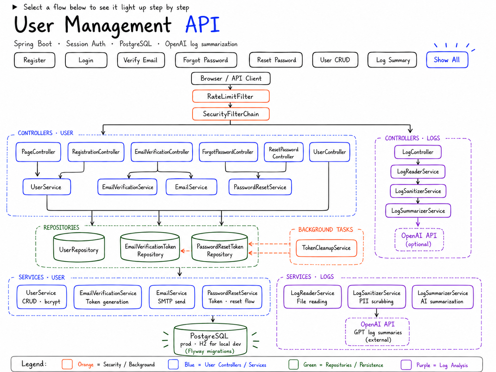
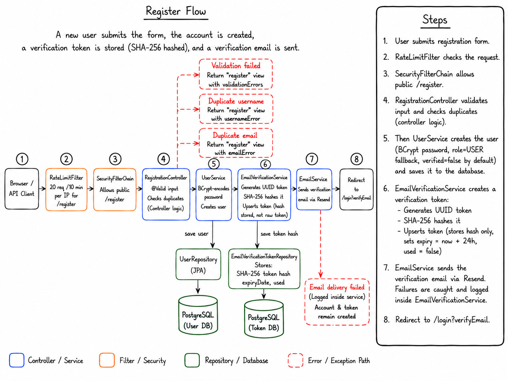
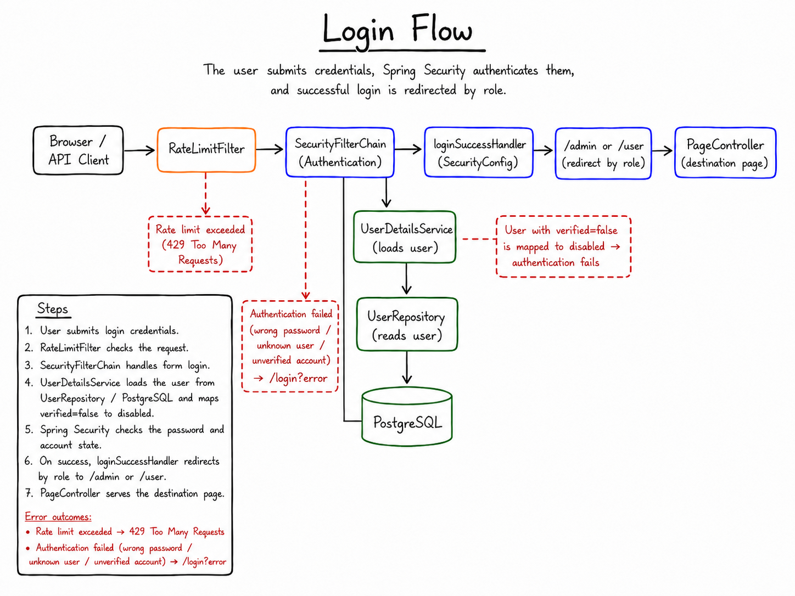
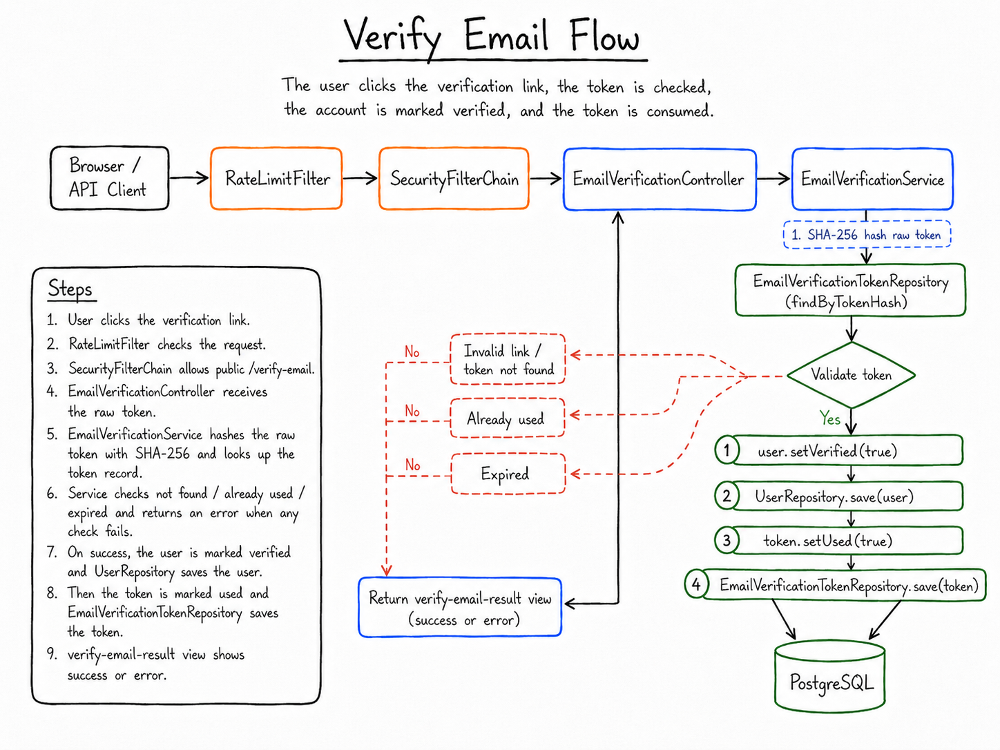
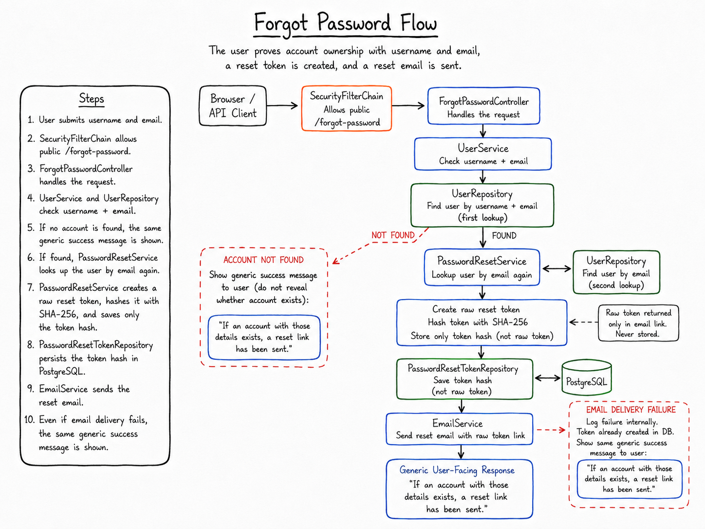
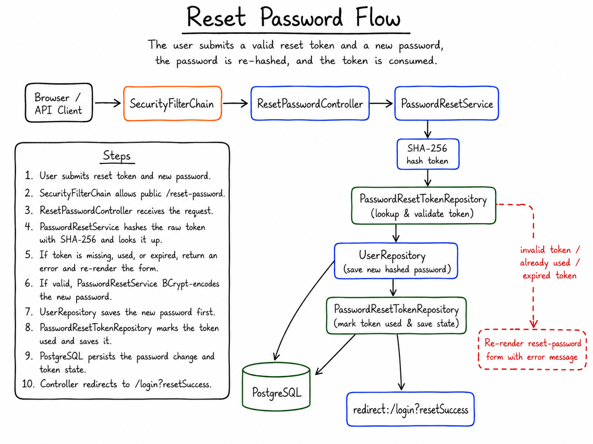
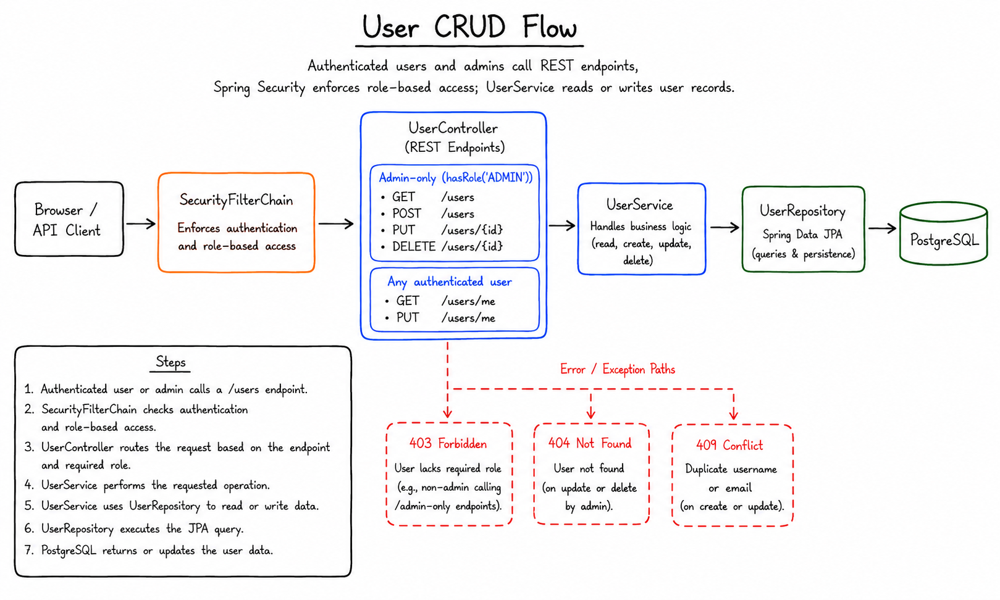
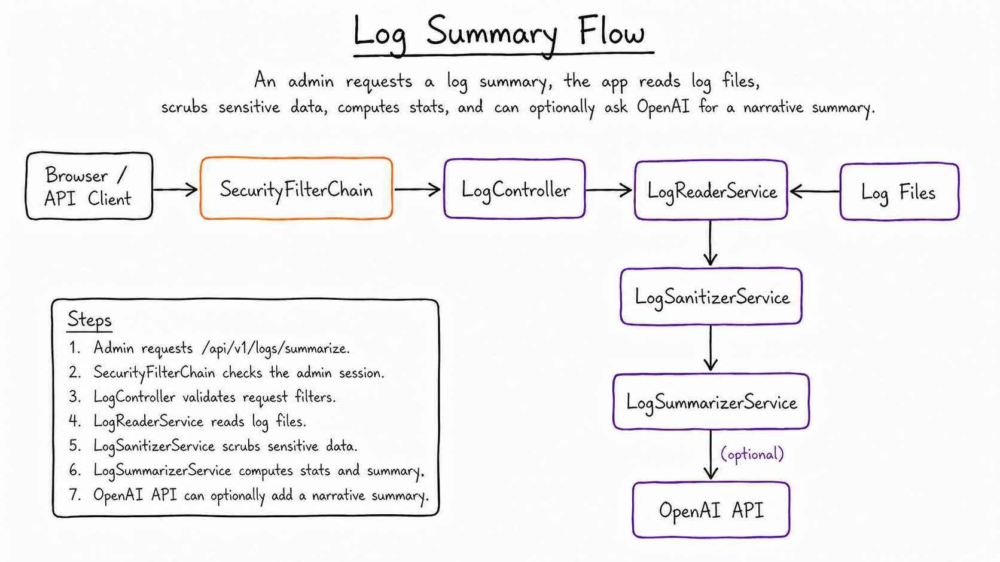

# user-management-api

A streamlined Spring Boot application for managing user accounts with authentication, registration, profile updates, and basic REST endpoints.

## About

- Authentication & authorization with role-based access (ADMIN / USER)
- Registration with email verification
- Password reset via secure tokens
- User profile management (`/users/me`)
- Optional AI-powered log summarization

## Architecture Diagram

<p align="center">
  
</p>

## Flow walkthroughs

These hand-drawn flow diagrams show the main request paths through the application. Box colors match the architecture layers: orange for security/filtering, blue for user-facing controllers and services, green for repositories and persistence, and purple for log analysis.

<p align="center">
  
</p>

<p align="center">
  
</p>

<p align="center">
  
</p>


<p align="center">
  
</p>

<p align="center">
  
</p>

<p align="center">
  
</p>

<p align="center">
  
</p>

## Features Overview

### Rate Limiting
- IP-based rate limiting on critical public endpoints
- Token bucket algorithm (Bucket4j)
- Example: `/login` limited to 10 requests per minute

### Secure Password Handling
- Passwords hashed with **BCrypt**
- Token-based password reset flow
- Email-based reset link generation

### Session-Based Authentication
- Form login with HTTP sessions (Spring Security)
- Role-based redirects to `/admin` and `/user` dashboards
- Email verification required before login

### Structured Logging
- JSON-style logs with sensitive data masked
- Optional AI log summaries via `/api/v1/logs/summarize`

## REST API – Key Endpoints
[try out the REST API on swagger](https://user-management-api-java.up.railway.app/swagger-ui/index.html)

**Public**

- `POST /register` – Create a new account
- `GET /verify-email?token=...` – Verify account
- `POST /forgot-password` – Request password reset
- `POST /reset-password?token=...` – Set new password

**Authenticated Users**

- `GET /users/me` – View own profile
- `PUT /users/me` – Update own email / password

**Admin Only**

- `GET /users` – List all users
- `POST /users` – Create user
- `PUT /users/{id}` – Update any user
- `DELETE /users/{id}` – Delete user

## Requirements

- Java 17+
- Spring Boot 3.4.5
- Maven 3.6+
- PostgreSQL (prod) or H2 (local dev)

## Quick Setup

**Local (H2, no external DB):**
```bash
mvn spring-boot:run -Dspring-boot.run.profiles=local
```

**Docker (PostgreSQL):**

Build the image first:
```bash
docker build -t user-management-api .
```

Then run (pointing at an external PostgreSQL instance with SSL):
```bash
docker run -d -p 8080:8080 \
  -e PGHOST=your-db-host \
  -e PGPORT=5432 \
  -e PGDATABASE=userdb \
  -e PGUSER=dbuser \
  -e PGPASSWORD=dbpass \
  -e APP_BASE_URL=https://your-domain.com \
  -e RESEND_API_KEY=your-resend-api-key \
  -e RESEND_FROM="User Management <noreply@your-domain.com>" \
  user-management-api
```

**Local Docker with a PostgreSQL container** (no SSL, fresh schema):
```bash
docker network create uma-net

docker run -d --name uma-postgres --network uma-net \
  -e POSTGRES_DB=userdb -e POSTGRES_USER=dbuser -e POSTGRES_PASSWORD=dbpass \
  postgres:16-alpine

docker run -d --name uma-app --network uma-net -p 8080:8080 \
  -e "SPRING_DATASOURCE_URL=jdbc:postgresql://uma-postgres:5432/userdb?sslmode=disable" \
  -e SPRING_DATASOURCE_USERNAME=dbuser \
  -e SPRING_DATASOURCE_PASSWORD=dbpass \
  -e SPRING_JPA_HIBERNATE_DDL_AUTO=update \
  -e APP_BASE_URL=http://localhost:8080 \
  -e RESEND_API_KEY=your-resend-api-key \
  -e RESEND_FROM="User Management <noreply@example.com>" \
  user-management-api
```

> **Note:** The production datasource URL (`application.properties`) requires `sslmode=require`. Local PostgreSQL containers do not have SSL configured, so the full URL override with `sslmode=disable` is needed. `SPRING_JPA_HIBERNATE_DDL_AUTO=update` lets Hibernate create the schema on first run since no DDL migration scripts are included.

## License

For educational and demonstration purposes.

## Design notes

**Why SHA-256 for tokens but BCrypt for passwords** — Password reset and email verification tokens need to be looked up by value: the raw token comes back in a URL, and the server needs to find the matching database row. BCrypt salts every hash, making two hashes of the same input always different — lookup by value is impossible. SHA-256 is deterministic, which makes the lookup work. It's safe here because the input is a random UUID, not a guessable string; nobody brute-forces a UUID the way they'd brute-force "password123". Passwords still use BCrypt, because they're low-entropy and are always verified by comparison, never fetched by value.

**Why sessions over JWT** — This is a browser-facing app with server-rendered pages, so a cookie pointing to a server-side session fits naturally. The main upside is instant revocability: deleting the session row logs the user out immediately, with no need to wait for a token to expire. JWT works well for machine-facing APIs where statelessness and horizontal scale matter more, but for a browser-facing app with server-rendered pages, sessions are the simpler and more revocable choice.

**Why the rate limiter is a servlet filter** — The filter rejects abusive IPs before requests reach controller code or the repository layer. One important caveat: Spring Boot's Spring Security filter defaults to order −100, meaning it runs before `@Order(1)` filters. For endpoints Spring Security intercepts directly (such as form-login `POST /login`), Security processes the request first — so the rate limiter does not protect the authentication layer itself. It guards the application layer downstream of Security.

**Known limits** — Sessions and rate-limit buckets are both in-memory, so a second app instance breaks session stickiness and doubles the effective rate limit. Spring Session backed by Redis handles the first; a distributed Bucket4j backend handles the second. Email is sent via the Resend API with configurable retries (default 3 attempts), so transient failures are handled — the remaining gap is a durable outbox: if the process crashes mid-send, no retry happens.
